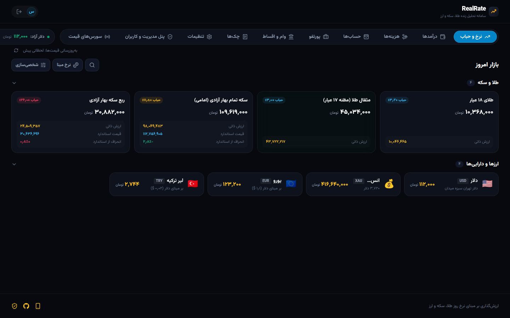
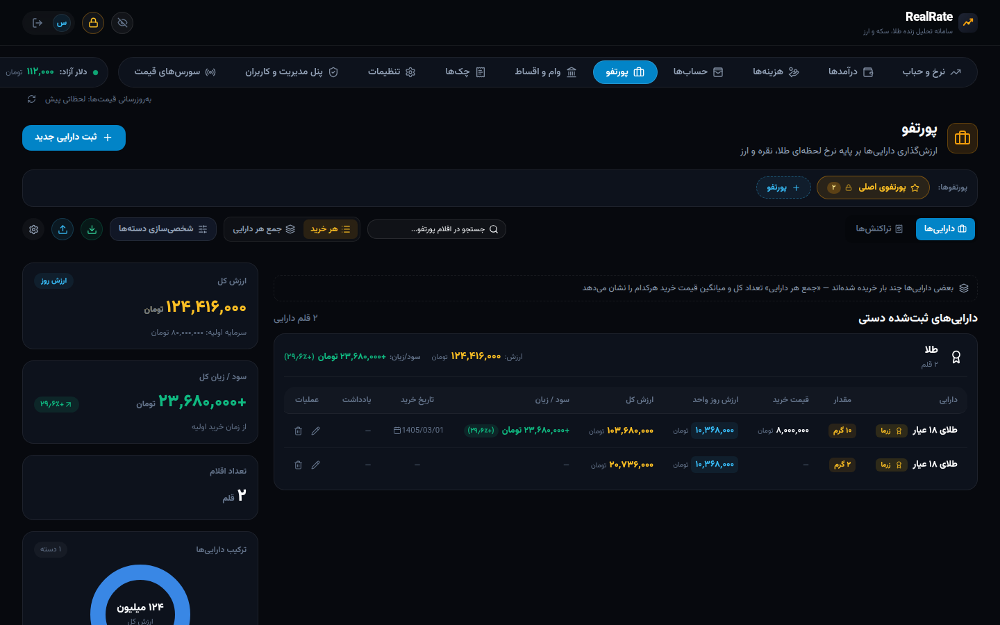
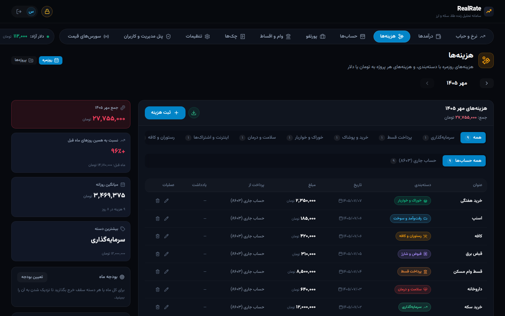
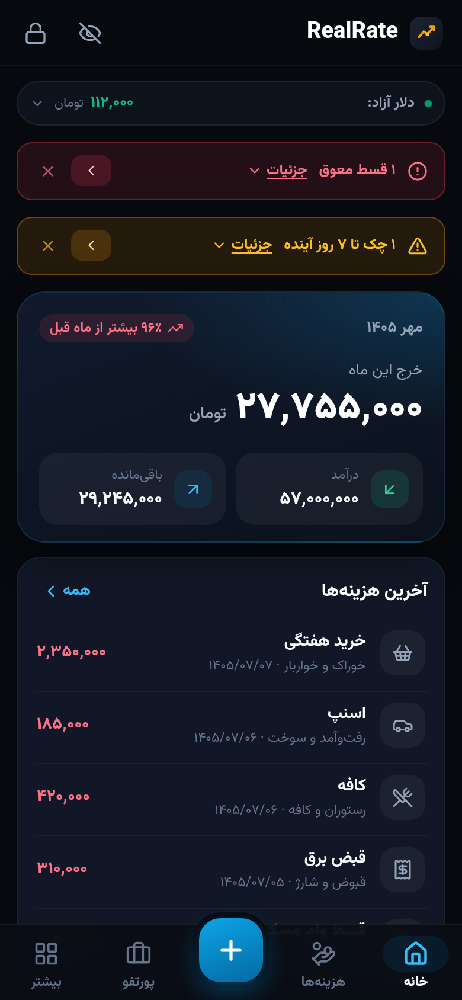
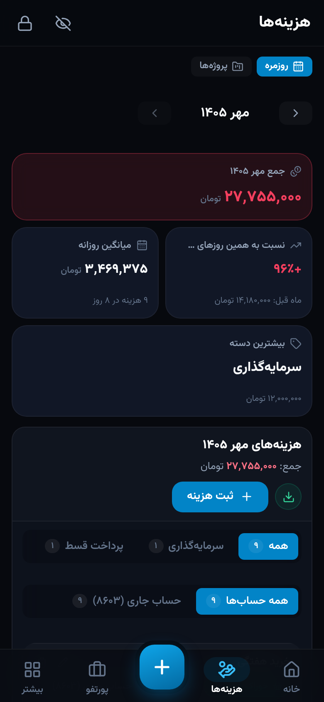
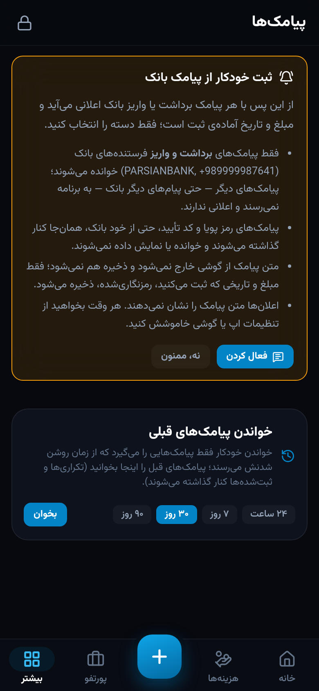
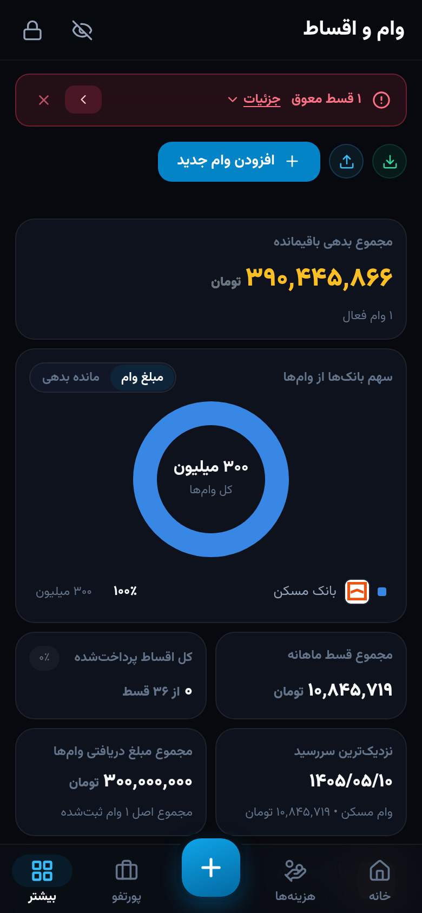

# 🪙 RealRate

<div align="center">

[فارسی](README.md) · **English**

[](https://workers.cloudflare.com/)
[](https://react.dev/)
[](https://vitejs.dev/)
[](https://developers.cloudflare.com/d1/)
[](docs/en/ANDROID.md)
[](https://vitest.dev/)




</div>

**RealRate** is a market analysis and personal finance app for Iran, running on Cloudflare's edge.
It computes the intrinsic value and the bubble of gold and coins, tracks currencies, stocks and funds, and manages
portfolios, expenses, accounts, loans, incomes, cheques and subscriptions — all end-to-end encrypted.
The web app is at [realrate.geekio.org](https://realrate.geekio.org); the Android app (which records expenses from bank SMS) is on the
[app page](https://realrate.geekio.org/android) or the [latest release](https://github.com/nos486/realrate/releases/latest/download/realrate.apk).

The interface is in Persian (right-to-left, Shamsi calendar, amounts in tomans).

## Features

- **Market**: intrinsic value and bubble of gold and coins (and the coins' bubble from tgju), 16 currencies and USDT, Tehran Stock Exchange symbols and funds — updated automatically, on a home page each user lays out (averages, linked assets, and cards combining assets with a formula) (the rates page is for Pro users)
- **Portfolio**: multiple portfolios, buy/sell transactions with weighted average cost, live profit and loss, custom categories, public sharing
- **Expenses**: everyday expenses by category with monthly budgets, projects, each expense in tomans, dollars, euros, lira or dirhams, the account that paid («پرداخت از») and the loan that funded it («تأمین از»)
- **Accounts**: bank accounts, cash and wallets, each in one or more currencies; the source of every expense and the match for bank SMS
- **Bank credit** (new): the limit and the debt, spending from the credit, «تسویه بدهی» and «تبدیل به قسط» by hand (each installment with its own day and amount), and the settlement and installment fees worked out from those amounts and kept with their record
- **Loans**: installment schedule, payments and extra payments, banks with logos, and loan usage (what the loan paid for, and how those purchases did against the loan's rate)
- **Incomes**: by source and month, in tomans or a foreign currency, and fixed incomes (salary, rent) that repeat on their own
- **Cheques**: received and issued, due dates, status tracking with history, reminders, and AI cheque scanning; a cleared cheque records its income or expense
- **Subscriptions** (new): every subscription in tomans or dollars with its renewal cycle, start and end; the monthly and yearly total, recording a payment, and a reminder before each renewal
- **Market news** (new): dollar, gold, oil and economy news from news channels, checked and sorted every minute by AI (Workers AI) — no ads, signals or duplicates; importance 1–3, the day's and week's top stories, and notifications for the important ones
- **AI day's analysis** (new): what today's news says, how the stories connect and what to watch — no price predictions; the latest analysis is also on the website's landing page
- **Yearly report** (new): a Shamsi year on one page — income and expenses, savings rate, the share of income invested, dollar value and the year's highlights; PDF and CSV export
- **Android app**: bottom navigation and quick add, automatic reading of bank withdrawal and deposit SMS (the text never leaves the phone), one-tap and automatic recording of small expenses, fingerprint unlock, offline use
- **End-to-end encryption**: all financial data is encrypted on the user's device; the server only sees ciphertext
- **Accounts and admin**: Google or email sign-in, a demo account, an admin panel (users, groups and feature access, Android app users and their versions, price sources)

Details: [docs/en/FEATURES.md](docs/en/FEATURES.md)

## Screenshots

| Portfolio | Everyday expenses |
| :---: | :---: |
|  |  |

<div align="center">

| App home | Expenses | Bank SMS | Loans |
| :---: | :---: | :---: | :---: |
|  |  |  |  |

</div>

## Quick start

```bash
git clone https://github.com/nos486/realrate.git
cd realrate
npm install
npm run dev    # API: http://localhost:8787 — web: http://localhost:5173
npm test
```

Running locally needs only wrangler (local D1 and KV): [docs/en/SETUP.md](docs/en/SETUP.md).

## Deployment

A merge into `main` deploys everything: the frontend to Cloudflare Pages, the backend with Cloudflare Workers Builds, and a
signed Android APK to [Releases](https://github.com/nos486/realrate/releases) (GitHub Actions).
Manual backend deploy when needed: `npm run api:deploy`.
Full guide (D1 and KV, Google sign-in, email, Pages, Workers, the Android signing key): [docs/en/SETUP.md](docs/en/SETUP.md)

## Documentation

| Document | Topic |
| :--- | :--- |
| [FEATURES.md](docs/en/FEATURES.md) | Every feature in detail |
| [SETUP.md](docs/en/SETUP.md) | Local setup, configuration and deployment |
| [PROJECT_STRUCTURE.md](docs/en/PROJECT_STRUCTURE.md) | Repository layout and shared files |
| [ARCHITECTURE.md](docs/ARCHITECTURE.md) | Architecture and data flow |
| [API.md](docs/API.md) | REST API reference |
| [E2EE_VAULT.md](docs/en/E2EE_VAULT.md) | Account-wide end-to-end encryption, sync and the offline copy |
| [ANDROID.md](docs/en/ANDROID.md) | Android app: build, signing, releases, bank SMS, fingerprint, offline |
| [BANK_SMS.md](docs/en/BANK_SMS.md) | Bank SMS templates and adding a bank |
| [EXPENSES.md](docs/en/EXPENSES.md) | Expense, account, budget and loan-funding data model |
| [DESIGN.md](docs/en/DESIGN.md) | Color and layout standard |
| [ADDING_NEW_ASSET.md](docs/en/ADDING_NEW_ASSET.md) | Adding an asset |
| [ADDING_NEW_PRICE_SOURCE.md](docs/en/ADDING_NEW_PRICE_SOURCE.md) | Adding a price source |

All English documents: [docs/en](docs/en/README.md)

## License

MIT
