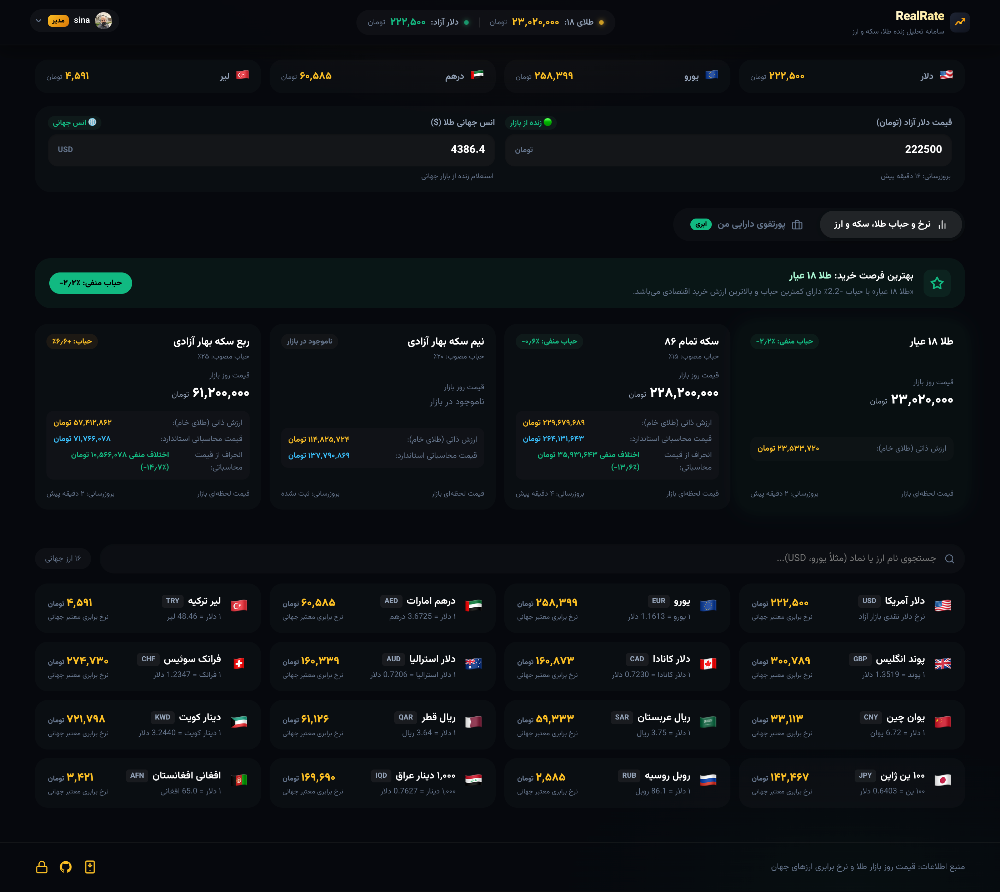
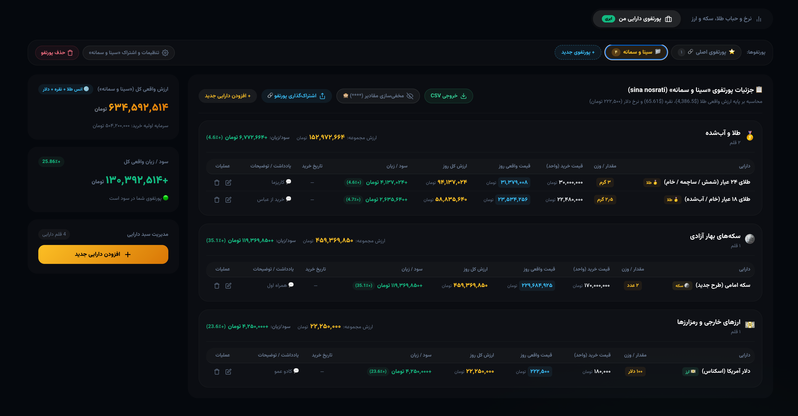

# 🪙 RealRate — Real-Time Gold, Coin, Forex & Cloud Portfolio Platform

<div align="center">

[](https://workers.cloudflare.com/)
[](https://react.dev/)
[](https://vitejs.dev/)
[-blue?style=for-the-badge&logo=sqlite&logoColor=white)](https://developers.cloudflare.com/d1/)
[](LICENSE)

<br />

### 📊 تحلیل زنده نرخ و حباب طلا، سکه و ارز | Market Rates & Bubble Analysis


<br />

### 💼 پورتفوی ابری هوشمند چندگانه | Multi-Portfolio Cloud Tracker


</div>

---

### 🌐 Overview (English)

**RealRate** is a modern, high-performance financial analytics suite and cloud multi-portfolio tracker tailored for the Iranian gold, coin, and foreign exchange markets. It calculates intrinsic mathematical values and market bubbles using real-time global spot gold prices and open-market USD rates, provides live currency conversions across 16+ world currencies, and empowers investors to manage unlimited personalized cloud portfolios stored securely in a serverless relational database (Cloudflare D1 SQLite) with real-time profit and loss (PnL) analytics, public shareable links, and CSV reporting.

#### 🚀 Key Features
- **🪙 Gold & Coin Bubble Analysis**: Calculates pure gold intrinsic value for 18K and 24K gold (bars, grains, raw), Emami coins, Bahar Azadi, Half, Quarter, and Gerami coins based on international spot ounce prices and free-market USD exchange rates. Includes comparative bubble metrics and smart buy recommendations.
- **💼 Multi-Portfolio Management (NEW)**: Create, rename, customize, and manage multiple isolated investment portfolios with separate holdings, purchase histories, and performance analytics.
- **📋 Compact Table View**: Dense, informative tabular asset presentation organizing holdings by asset class (Gold/Melted, Coins, Currencies/Crypto) with purchase price, live market value, profit/loss, purchase date, notes, and instant actions.
- **🔗 Shareable Portfolio Links**: Generate public, read-only vanity links (`/p/:slug`) with customizable privacy switches to showcase your portfolio without granting edit access.
- **🔒 Privacy Mode (`****`)**: One-click incognito masking toggle to hide portfolio amounts and asset values when viewing in public spaces.
- **📥 CSV Export**: Instant one-click CSV export formatted for Microsoft Excel and Google Sheets with detailed breakdowns of holdings, purchase prices, and returns.
- **📅 Shamsi Date Picker & Quick "Today" Action**: Interactive Jalali date selector (Year, Month, Day dropdowns) plus a single-click `⚡ امروز` (Today) button, backed by native calendar fallback.
- **💱 Global Forex Rates**: Instant conversion of major currencies (USD, EUR, AED, TRY, GBP, CAD, CHF, KWD, SAR, etc.) into Tomans using live cross-rates with quick search.
- **🛡️ Fullscreen Loading Guard**: Interactive fullscreen modal overlay with animated glowing indicator preventing race conditions and unintentional actions during async server operations.
- **🔐 Google OAuth (GIS)**: Seamless authentication with Google Identity Services, 30-day secure session management, and role-based access control.
- **📊 Admin Panel & Analytics**: Real-time traffic monitoring, active users within the last 5 minutes, registered user management, and dynamic system-wide configuration without redeploying.

#### 🏗️ Architecture
RealRate is structured as an **npm workspaces monorepo**:
- **`api/`**: Pure JSON REST API running on Cloudflare Workers, integrated with Cloudflare D1 (SQLite) and Cloudflare KV.
- **`web/`**: Modern Single Page Application (SPA) built with React 19, Vite, and custom dark glassmorphism CSS, hosted on Cloudflare Pages.

---

# 🪙 راهنمای جامع فارسی سامانه RealRate

سامانه هوشمند و پیشرفته **RealRate**، پلتفرم تحلیل بازار طلا، سکه، ارزهای مطرح جهان و **مدیریت پورتفوی ابری سرمایه‌گذاری چندگانه** با تمرکز بر شفافیت قیمت‌ها، محاسبات دقیق ریاضی و رابط کاربری مدرن (Fintech Dark Glassmorphism) است.

---

## ✨ امکانات و قابلیت‌های اصلی

### 💼 ۱. مدیریت هوشمند پورتفوی ابری چندگانه (Multi-Portfolio Cloud Tracker)
- **ساخت چند پورتفوی مجزا با نام‌های دلخواه**:
  - امکان ایجاد چندین پورتفوی تفکیک‌شده برای اهداف مختلف (مثلاً «پورتفوی شخصی»، «سرمایه‌گذاری خانواده»، «صندوق پس‌انداز طلا»).
  - جابجایی فوق‌العاده سریع و آنی میان پورتفوها بدون تداخل داده‌ها.
  - امکان تغییر نام، حذف و سفارشی‌سازی تنظیمات هر پورتفو به طور جداگانه.
- **نمایش جدولی فشرده و استاندارد (Compact Table Layout)**:
  - ساختار بهینه‌سازی شده در قالب سطرهای منظم جدولی به همراه عنوان ستون‌ها: **دارایی**، **مقدار / وزن**، **قیمت خرید واحد**، **قیمت واقعی روز**، **ارزش کل روز**، **سود / زیان**، **تاریخ خرید**، **یادداشت / توضیحات** و **عملیات (ویرایش/حذف)**.
  - گروه‌بندی خودکار اقلام بر اساس دسته‌بندی‌های:
    - 🥇 **طلا و آب‌شده**: پشتیبانی کامل از **طلای ۲۴ عیار (شمش / ساچمه / خام خالص)** و **طلای ۱۸ عیار (خام / آب‌شده)**.
    - 🌕 **سکه‌های بهار آزادی**: سکه تمام طرح جدید (امامی)، طرح قدیم، نیم‌سکه، ربع‌سکه و سکه گرمی.
    - 💵 **ارزهای خارجی و رمزارزها**: دلار آمریکا، یورو، درهم، لیر، تتر (USDT) و سایر ارزها.
- **انتخاب‌گر تاریخ شمسی و دکمه سریع «⚡ امروز»**:
  - دکمه میانبر «⚡ امروز» جهت درج خودکار و یک‌کلیکه تاریخ روز جاری شمسی.
  - پنل انتخاب‌گر تاریخ شمسی (Date Selector) با امکان تعیین مجزای **سال**، **ماه** و **روز**.
  - پشتیبانی همزمان از تقویم پیش‌فرض سیستم با تبدیل خودکار میلادی به شمسی.
- **اشتراک‌گذاری پورتفو با پیوند عمومی (Public Portfolio Sharing)**:
  - قابلیت ایجاد لینک اختصاصی خواندنی (`/p/slug`) جهت اشتراک‌گذاری سبد دارایی با دیگران بدون امکان ویرایش.
  - امکان فعال/غیرفعال‌سازی لحظه‌ای اشتراک‌گذاری با یک کلیک.
- **حالت حریم خصوصی و مخفی‌سازی ارقام (`****`)**:
  - دکمه اختصاصی ماسک کردن مقادیر برای استفاده امن در اماکن عمومی و عدم افشای مبالغ سرمایه‌گذاری.
- **خروجی اکسل و CSV از هر پورتفو**:
  - دریافت مستقیم فایل خروجی استاندارد با فرمت UTF-8 سازگار با Excel و Google Sheets شامل تمام جزئیات پورتفو و سود/زیان.
- **محاسبه آنلاین و زنده سود و زیان (PnL)**:
  - محاسبه آنی ارزش روز دارایی‌ها بر اساس آخرین قیمت‌های بازار و انس جهانی.
  - نمایش سود/زیان تومانی و درصدی برای هر سطر و برای کل پورتفو.
- **ذخیره‌سازی ابری در دیتابیس Cloudflare D1 (SQLite)**:
  - امنیت کامل داده‌ها، دسترسی دائمی از همه دستگاه‌ها بدون خطر از دست رفتن داده‌های لوکال.
  - سیستم مایگریشن خودکار (Auto-Migration) جهت انتقال دارایی‌های پیشین به سرور ابری در اولین ورود.

---

### 📊 ۲. تحلیل حباب طلا و انواع سکه
- **محاسبه ارزش ذاتی و واقعی خام طلا**: محاسبه ارزش ریاضی طلای خالص بر پایه انس جهانی ($) و نرخ دلار آزاد (تومان).
- **تحلیل دوگانه حباب**:
  - سنجش حباب نسبت به **ارزش طلای خام**.
  - سنجش انحراف نسبت به **قیمت انتظاری با حباب مصوب**.
- **پیشنهاد هوشمند اقتصادی (Smart Recommendation)**: شناسایی خودکار کم‌حباب‌ترین و باارزش‌ترین قلم طلا/سکه جهت خرید با برچسب بصری برجسته.
- **شناسایی حباب منفی و وضعیت اقلام**: تفکیک بصری وضعیت حباب مثبت/منفی و مدیریت اقلام ناموجود در بازار بدون قیمت‌سازی کاذب.

---

### 💱 ۳. نرخ لحظه‌ای ارزهای جهان
- دریافت زنده نرخ‌های برابری از مراجع بین‌المللی و تبدیل خودکار به تومان برای بیش از ۱۶ ارز معتبر:
  - 🇺🇸 **دلار آمریکا (USD)**
  - 🇪🇺 **یورو اروپا (EUR)**
  - 🇦🇪 **درهم امارات (AED)**
  - 🇹🇷 **لیر ترکیه (TRY)**
  - 🇬🇧 **پوند انگلیس (GBP)**
  - 🇨🇦 **دلار کانادا (CAD)**
  - 🇦🇺 **دلار استرالیا (AUD)**
  - 🇨🇭 **فرانک سوئیس (CHF)**
  - 🇰🇼 **دینار کویت (KWD)**
  - 🇶🇦 **ریال قطر (QAR)**
  - 🇸🇦 **ریال عربستان (SAR)**
  - 🇨🇳 **یوان چین (CNY)**
  - 🇷🇺 **روبل روسیه (RUB)**
  - 🇯🇵 **۱۰۰ ین ژاپن (JPY)**
  - 🇮🇶 **۱,۰۰۰ دینار عراق (IQD)**
  - 🇦🇫 **افغانی افغانستان (AFN)**
- فیلتر و جستجوی لحظه‌ای بر اساس نام فارسی، انگلیسی و کد ۳ حرفی ارز.

---

### 🛡️ ۴. لودر تمام‌صفحه محافظ (Fullscreen Loader Guard)
- نمایش نشانگر لودینگ مدرن نئونی در هنگام بارگذاری داده‌ها از سرور.
- قفل کردن صفحه در زمان همگام‌سازی اطلاعات جهت جلوگیری از کلیک‌های ناخواسته، ایجاد Race Condition یا درخواست‌های تکراری توسط کاربر.

---

### 🔐 ۵. سیستم احراز هویت و پنل مدیریت
- **ورود سریع با حساب گوگل (Google GIS)**: بدون نیاز به رمز عبور، با توکن‌های امن و نشست ۳۰ روزه.
- **مدیریت سطح دسترسی (RBAC)**: شناسایی مدیر سیستم بر اساس ایمیل تعیین‌شده در `ADMIN_EMAIL`.
- **پنل مدیریت پیشرفته (`/admin`)**:
  - آمار زنده تعداد کاربران آنلاین طی ۵ دقیقه گذشته بر پایه IP.
  - تعداد کل بازدیدها و شمارش کاربران ثبت‌نام شده.
  - لیست کاربران به همراه تصویر پروفایل، تاریخ اولین و آخرین ورود و تعداد دفعات لاگین.
  - تغییر پویای درصد حباب مصوب و ارسال پیام/اطلاعیه همگانی در بالای سایت.

---

## 🏗️ ساختار مخزن (Monorepo Architecture)

```text
realrate/
├── package.json               # تنظیمات اصلی Workspaces و اسکریپت‌های مشترک
├── README.md                  # راهنمای جامع پروژه
├── realrate_1.png             # تصویر رابط کاربری: نرخ و حباب طلا و ارز
├── realrate_2.png             # تصویر رابط کاربری: مدیریت پورتفوی ابری
│
├── api/                       # سرویس بک‌اند (Cloudflare Worker REST API)
│   ├── wrangler.toml          # پیکربندی کلاودفلر (Bindings: D1, KV, Vars)
│   ├── schema.sql             # ساختار جداول دیتابیس (users, portfolios, holdings, etc.)
│   ├── package.json
│   └── src/
│       ├── index.js           # روتر اصلی و ورودی ورکر
│       ├── handlers/          # کنترلرهای مسیرها (api, auth, admin, portfolio)
│       │   ├── apiRoutes.js
│       │   ├── authRoutes.js
│       │   ├── adminRoutes.js
│       │   └── portfolioRoutes.js
│       ├── lib/               # ابزارهای پایگاه داده، احراز هویت و تنظیمات
│       │   ├── db.js          # ارتباط با D1 و KV به همراه Auto-Migration
│       │   ├── auth.js        # احراز هویت سشن و بررسی ادمین
│       │   ├── settings.js
│       │   ├── analytics.js
│       │   └── helpers.js     # پاسخ‌های JSON و هدرهای داینامیک CORS
│       └── services/          # دریافت داده‌های خارجی (انس طلا، ارزها، تلگرام)
│
└── web/                       # سرویس فرانت‌اند (React 19 + Vite SPA)
    ├── vite.config.js         # کانفیگ بیلد و پروکسی توسعه
    ├── package.json
    ├── .env.production        # آدرس API پروداکشن (VITE_API_URL)
    └── src/
        ├── App.jsx            # روتینگ برنامه با React Router
        ├── main.jsx
        ├── api/client.js      # کلاینت متمرکز فراخوانی APIها با توکن احراز هویت
        ├── context/           # کانتکست احراز هویت (AuthContext)
        ├── hooks/             # هوک‌های داده بازار و محاسبات
        ├── components/        # کامپوننت‌های رابط کاربری
        │   ├── Header.jsx
        │   ├── AnalysisCards.jsx
        │   ├── CurrenciesList.jsx
        │   ├── PortfolioTracker.jsx # ردیاب پورتفو با گیت احراز هویت و چند پورتفویی
        │   ├── FullscreenLoader.jsx # لودر سراسری محافظ
        │   ├── AdminPanel.jsx
        │   └── Footer.jsx
        ├── pages/
        │   ├── MainPage.jsx   # صفحه اصلی با تب‌بندی مدرن
        │   ├── AdminPage.jsx  # صفحه پنل مدیریت
        │   └── SharedPortfolioPage.jsx # صفحه عمومی مشاهده پورتفو اشتراکی
        └── styles/
            └── index.css      # سیستم طراحی دارک و گلس‌مورفیسم فین‌تک
```

---

## 🚀 راهنمای نصب و اجرای محلی (Local Development)

### پیش‌نیازها
- Node.js نسخه 20 یا بالاتر
- npm نسخه 9 یا بالاتر

### ۱. دریافت پروژه و نصب پکیج‌ها
```bash
git clone https://github.com/nos486/realrate.git
cd realrate
npm install
```

### ۲. اجرای همزمان بک‌اند و فرانت‌اند
با اجرای یک دستور، سرور ورکر (پورت `8787`) و فرانت‌اند Vite (پورت `5173`) اجرا می‌شوند:
```bash
npm run dev
```

آدرس‌های محلی:
- فرانت‌اند: `http://localhost:5173`
- بک‌اند API: `http://localhost:8787`

همچنین می‌توانید هر کدام را به صورت مجزا اجرا کنید:
```bash
npm run api:dev   # اجرای فقط بک‌اند ورکر
npm run web:dev   # اجرای فقط فرانت‌اند ری‌اکت
```

---

## 🗄️ راه‌اندازی پایگاه‌داده Cloudflare D1 و KV

پروژه از دیتابیس **Cloudflare D1 (SQLite)** برای ذخیره کاربران، نشست‌ها، پورتفوها، دارایی‌ها و تنظیمات استفاده می‌کند.

### ۱. ساخت دیتابیس D1 در کلاودفلر
```bash
npx wrangler d1 create realrate-db
```
شناسه برگشتی (`database_id`) را در فایل `api/wrangler.toml` قرار دهید:
```toml
[[d1_databases]]
binding = "DB"
database_name = "realrate-db"
database_id = "<شناسه_دیتابیس_شما>"
```

### ۲. ساخت فضای KV
```bash
npx wrangler kv:namespace create REALRATE_KV
```
شناسه برگشتی را در `api/wrangler.toml` بخش `kv_namespaces` وارد کنید.

### ۳. اعمال مایگریشن جداول
جداول پایگاه داده به صورت خودکار با قابلیت **Auto-Bootstrap** در اولین درخواست ورکر ساخته و به‌روزرسانی می‌شوند، اما می‌توانید فایل `schema.sql` را دستی نیز اعمال کنید:
```bash
# محیط آنلاین
npx wrangler d1 execute realrate-db --remote --file=./api/schema.sql
```

---

## 🔑 تنظیم ورود با گوگل (Google OAuth Setup)

1. وارد [Google Cloud Console](https://console.cloud.google.com/) شوید و یک پروژه بسازید.
2. از مسیر **APIs & Services > Credentials** یک **OAuth 2.0 Client ID** از نوع **Web application** بسازید.
3. در بخش **Authorized JavaScript origins** آدرس‌های مجاز را اضافه کنید:
   - `http://localhost:5173`
   - `http://localhost:8787`
   - `https://realrate.pages.dev` (یا دامنه اختصاصی فرانت‌اند شما)
4. شناسه کلاینت دریافت شده (`Client ID`) را در تنظیمات وارد کنید:
   - در `api/wrangler.toml` زیر `[vars]`:
     ```toml
     GOOGLE_CLIENT_ID = "YOUR_CLIENT_ID.apps.googleusercontent.com"
     ADMIN_EMAIL = "your-email@gmail.com"
     ```
   - در فرانت‌اند برای بیلد محلی در فایل `web/.env.local`:
     ```env
     VITE_GOOGLE_CLIENT_ID=YOUR_CLIENT_ID.apps.googleusercontent.com
     ```

---

## 🌐 راهنمای استقرار در سرور ابری (Deployment)

### استقرار بک‌اند (Cloudflare Worker)
```bash
npm run api:deploy
```
یا از داخل دایرکتوری `api`:
```bash
cd api
npx wrangler deploy
```

### استقرار فرانت‌اند (Cloudflare Pages)
در پنل Cloudflare Dashboard به بخش **Workers & Pages > Create application > Pages > Connect to Git** بروید:
- **Project name**: `realrate`
- **Framework preset**: `Vite`
- **Root directory**: `web`
- **Build command**: `npm run build`
- **Build output directory**: `dist`
- **Environment variables**:
  - `VITE_API_URL`: آدرس ورکر بک‌اند شما (مثلاً `https://realrate-api.geekio.org`)
  - `VITE_GOOGLE_CLIENT_ID`: شناسه کلاینت گوگل

---

## 📜 لایسنس
این پروژه تحت مجوز [MIT License](LICENSE) منتشر شده است و استفاده از آن آزاد می‌باشد.
