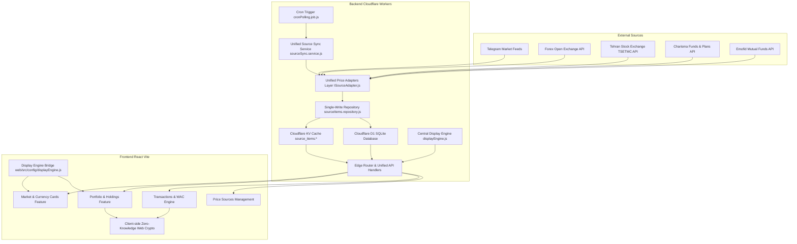

# RealRate System Architecture

RealRate is a financial analysis and portfolio management platform designed to calculate the **intrinsic (real) value** and **speculative bubble** of gold, coins, currencies, and capital market assets in Iran's market.

---

## High-Level Architecture Overview

The system is built as an ultra-fast, serverless monorepo consisting of:
- **Backend (`api/`)**: Built as an Edge-native Cloudflare Worker with zero framework overhead, Cloudflare D1 (SQLite at the edge), and Cloudflare KV (distributed low-latency cache).
- **Frontend (`web/`)**: A modern React SPA built with Vite, utilizing a modular **feature-based architecture**, custom hooks, vanilla CSS design tokens, and Web Crypto API for client-side Zero-Knowledge End-to-End Encryption (E2EE).
- **Display Engine Bridge (`displayEngine.js`)**: Symlinked between `api/src/domain/displayEngine.js` and `web/src/config/displayEngine.js`, guaranteeing 100% identical formatting, naming, unit resolution, and category metadata across both tiers.



---

## 1. Backend Architecture (`api/`)

The backend follows Clean Architecture principles divided into decoupled layers:

### A. Infrastructure Layer
- **Error Handling (`api/src/infrastructure/errors.js`)**: Standardized custom application errors (`AppError`, `ValidationError`, `NotFoundError`, `AuthError`, `ConflictError`, `DatabaseError`) mapped to HTTP status codes and uniform JSON responses.
- **Structured Logger (`api/src/lib/logger.js` & `api/src/infrastructure/logger.js`)**: Level-based logging (`DEBUG`, `INFO`, `WARN`, `ERROR`) outputting structured JSON logs with correlation IDs, timestamps, and request context.
- **Environment Configuration (`api/src/infrastructure/config.js`)**: Type-safe validation and centralized access for Cloudflare Worker bindings (`DB`, `KV`, secrets, Google OAuth client credentials).

### B. Repository Layer (`api/src/repositories/`)
Decouples database and KV storage queries from business logic. Direct SQL and KV queries are strictly encapsulated in repositories:
- `sourceItems.repository.js`: **Single persistence path for all price sources.** Provides `saveSourceItems(env, sourceId, items)` and `getSourceItems(env, sourceId)` unifying dual writes into a single standardized KV key (`source_items:{sourceId}`) and D1 mirror table.
- `domain/priceBook.js`: **The price standard.** Every source, automatic or manual, becomes the same item — `{ id, price, name, category, unit, sourceId, updatedAt, params }` — with `price` always in tomans and `id` unique and lower-case. A source declares what it quotes in (`quote`: `toman` by default, `rial`, `usd`, `usd_cross`); dollar quotes are converted once with the book's own USD price (so e.g. the lira is `usdCross × usd`), and gold, coin and silver intrinsic values are computed from the ounce (as items where no source prices them, and as `params.intrinsic`/`bubblePct` where one does). Ids: a single-price source gives its `priceType`, a multi-output feed its item code, a catalog `${sourceId}__${symbol}`; when two sources give the same id, the primary keeps it and the others become `${sourceId}__${id}`. These ids are used everywhere: stored user data, the home page, charts and the history. After every sync the whole book is written as one JSON to KV key `prices` (`GET /api/prices/book`).
- `domain/priceIds.js`: **Old stored ids → book ids, in one place.** Data saved before the standard carries ids like `src_def_usd`, `derived_gold_18k`, `EUR`, `forex_eur`, `bourse_فولاد`, `src_def_forex::try`, `gold_ounce`, `full_new`; `toPriceId(id, bookIds)` resolves any of them to the book's id, and `migrateRecordPriceIds` rewrites a record's `assetId` / `referenceAssetId` when the result exists in the book. The web app reads with it everywhere and migrates stored data with it: portfolio holdings and transactions are re-encrypted with the new id the next time they are read (`vaultPortfolioItems.js`), and a home page layout is saved again with book ids when it loads.
- **Web prices** (`features/market/priceBookAssets.js`, `PricingContext`): the browser never computes a price. It loads `/api/prices/book` and uses its prices by id — home cards, portfolio values, transactions, the asset search and trend cards alike. The USD / ounce inputs («نرخ مبنا») are the calculator's what-if rates: they change intrinsic value and bubble in the calculator, never a price.
- `priceHistory.repository.js`: **Price history, kept forever, in Postgres (Cloudflare Hyperdrive, binding `HYPERDRIVE`).** One table, `price_history (item_key, recorded_at, value)`, keyed by the price book's ids, created on the first write; a row is added only when an item's value differs from its latest stored value. Each sync records the book's items whose source synced, plus the computed ones. The writer is registered by the Worker entry (`index.js`) through `setPriceHistoryWriter`, because the web app shares market modules with the API and must not import the Postgres driver. `readPriceTrends` serves `GET /api/sparklines` (bucketed series for the home page's trend cards, edge-cached for 5 minutes). Without the binding, or when Postgres is down, nothing is recorded, trends report `available: false`, and the price sync carries on.
- `userRepository.js`: User accounts, roles, settings, Google OAuth mappings.
- `portfolioRepository.js`: Portfolios, multi-portfolio management, sharing slugs, salts, and verifiers.
- `holdingRepository.js`: Encrypted or plaintext holding items, quantities, purchase prices, dates, and notes.
- `transactionRepository.js`: Persistent storage for client-side encrypted buy/sell transactions with Zero-Knowledge payloads.
- `migration.repository.js`: Database schema migration and procedural seed synchronization directly from `PRICE_SOURCES_CONFIG`.
- `auditRepository.js`: Security and administrative audit log events.

### C. Unified Adapter Pattern for Ingestion (`api/src/services/market/sources/`)
All upstream price sources implement the standardized `ISourceAdapter` contract (`api/src/services/market/sources/ISourceAdapter.js`):
- **Unified Interface**:
  - `id`: Unique adapter identifier (e.g. `telegram`, `forex_api`, `bourse_symbols`, `emofid_funds`, `charisma_funds`, `charisma_plans`, `api_url`).
  - `name`: Human-readable Persian display name.
  - `supports(sourceConfig)`: Determines whether the adapter handles the specified configuration.
  - `fetchRaw(sourceConfig, env?)`: Fetches raw payload/HTML/JSON from the external endpoint.
  - `parse(raw, sourceConfig, env?)`: **Always** returns `{ items: [{ id, name, price }], datetime }`.
  - `getItems(env?)`: Unified method name across all adapters to retrieve current active items (retiring legacy method names).
- **Universal ID Convention**: All catalog items follow `\${sourceId}__\${itemKey}` (e.g. `src_def_bourse__فولاد`, `src_def_charisma__اهرم`).

### D. Single-Tick Polling Orchestrator (`api/src/services/market/sourceSync.service.js`)
- Replaces legacy parallel polling loops with a single unified function: `syncAllSources(env)`.
- Eliminates redundant network calls by automatically deduplicating endpoints shared by multiple sources.
- Executed on every minute tick by Cloudflare Worker Cron (`cronPolling.job.js`).

### E. Domain Specifications, Display Engine & Formulas (`api/src/domain/`)
- `domain/displayEngine.js`: **Central Master Display Engine** responsible for:
  - Resolving item display names: strictly formatted as `"{item.name} ({sourceName})"`.
  - Resolving item units, categories, and badges strictly from `sources.config.js` and `categories.config.js`.
  - Resolving visual colors and Lucide icons data-driven from category definitions.
- `domain/specs/registry.js`: Canonical registry of asset specifications (weight, purity, karat, units, categories).
- `domain/formulas.js`: Pure financial calculation functions:
  - $\text{Gram}_{24k} = \frac{\text{OuncePrice} \times \text{UsdPrice}}{31.1034768}$
  - $\text{IntrinsicValue} = \text{Gram}_{24k} \times \text{Weight} \times \frac{\text{Karat}}{24}$
  - $\text{Bubble} = \frac{\text{MarketPrice} - \text{IntrinsicValue}}{\text{MarketPrice}} \times 100$

---

## 2. Frontend Architecture (`web/`)

The frontend follows a **Feature-Driven Architecture**, keeping related UI, hooks, and API clients colocated.

### Directory Structure
```text
web/src/
├── config/
│   ├── displayEngine.js     # Symlink to api/src/domain/displayEngine.js
│   ├── sources.config.js    # Symlink to api/src/config/sources.config.js
│   └── categories.config.js # Symlink to api/src/config/categories.config.js
├── features/
│   ├── market/              # Market rates, analysis cards, forex list
│   ├── portfolio/           # Portfolio manager, holdings table, date picker, E2EE
│   ├── transactions/        # Buy/Sell Transactions & Automated Holdings Engine (WAC)
│   ├── auth/                # AuthContext, Google OAuth, session management
│   └── admin/               # Admin panel, feeds config, audit logs
├── components/
│   ├── UniversalAssetSearch.jsx # Data-driven universal search across all asset types
│   └── UserSettingsModal.jsx
├── shared/
│   ├── api/                 # httpClient.js (Fetch wrapper, auth tokens, standard error handling)
│   ├── components/          # Header, Navigation, Footer
│   └── ui/                  # AppLayout, Modal, NumericInput, AlertBanner, FilterPills
├── utils/                   # financialSpecs, pricingEngine, calculator
└── pages/                   # Top-level route pages (MainPage, SharedPortfolioPage, PriceSourcesPage)
```

### Key Frontend Features

1. **Central Display Engine Integration**:
   - Zero hardcoded switch statements or brand substring matching in UI components.
   - All presentation logic (names, units, categories, badges, colors, icons) delegates to `displayEngine.js`.
2. **Feature-Colocated State & Hooks**:
   - `usePortfolio`: Handles portfolio switching, creation, deletion, and synchronizing mode-aware badges.
   - `useHoldings`: Handles manual holdings retrieval, auto-migration, E2EE decryption, live bourse price synchronization.
   - `useTransactions`: Handles transaction CRUD with client-side Zero-Knowledge E2EE encryption and decryption.
   - `useComputedHoldings`: Automatically derives current holdings and Weighted Average Cost (WAC) from transaction history.
3. **Account-wide Zero-Knowledge E2EE** (`shared/vault/`, see [E2EE_VAULT.md](E2EE_VAULT.md)):
   - One passphrase (PBKDF2) unwraps a random account key, which wraps a per-portfolio key and encrypts loan, income and cheque records (AES-GCM 256).
   - `loanApi` / `incomeApi` / `chequeApi` route to encrypted in-browser stores when the vault is on; loans run on the shared pure engine `domain/loanDocument.js`, cheques validate with the shared `domain/chequeDocument.js`.
   - The server only stores ciphertext; passphrases never leave the client.
4. **Persian / Shamsi Localization**:
   - Native Jalali calendar calculations (`ShamsiDatePicker.jsx`).
   - "⚡ امروز" (Today) quick button.
   - Eastern Arabic / Persian number parsing and formatting.
5. **Privacy Mode (`btn-privacy-toggle`)**:
   - Masks numbers across all tables and cards with `****`.
   - Global event propagation via `CustomEvent('realrate_privacy_change')`.
