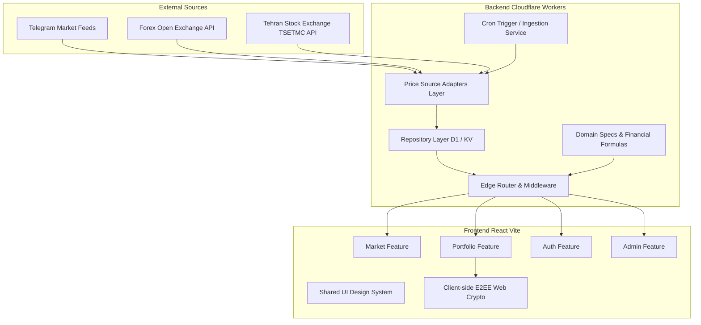

# RealRate System Architecture

RealRate is a financial analysis and portfolio management platform designed to calculate the **intrinsic (real) value** and **speculative bubble** of gold, coins, currencies, and capital market assets in Iran's market.

---

## High-Level Architecture Overview

The system is built as an ultra-fast, serverless monorepo consisting of:
- **Backend (`api/`)**: Built as an Edge-native Cloudflare Worker with zero framework overhead, Cloudflare D1 (SQLite at the edge), and Cloudflare KV (distributed low-latency cache).
- **Frontend (`web/`)**: A modern React SPA built with Vite, utilizing a modular **feature-based architecture**, custom hooks, vanilla CSS design tokens, and Web Crypto API for client-side Zero-Knowledge End-to-End Encryption (E2EE).



---

## 1. Backend Architecture (`api/`)

The backend follows Clean Architecture principles divided into decoupled layers:

### A. Infrastructure Layer
- **Error Handling (`api/src/infrastructure/errors.js`)**: Standardized custom application errors (`AppError`, `ValidationError`, `NotFoundError`, `AuthError`, `ConflictError`, `DatabaseError`) mapped to HTTP status codes and uniform JSON responses.
- **Structured Logger (`api/src/infrastructure/logger.js`)**: Level-based logging (`DEBUG`, `INFO`, `WARN`, `ERROR`) outputting structured JSON logs with correlation IDs, timestamps, and request context.
- **Environment Configuration (`api/src/infrastructure/config.js`)**: Type-safe validation and centralized access for Cloudflare Worker bindings (`DB`, `KV`, secrets, Google OAuth client credentials).

### B. Repository Layer (`api/src/repositories/`)
Decouples database and KV storage queries from business logic. Direct SQL and KV queries are strictly encapsulated in repositories:
- `userRepository.js`: User accounts, roles, settings, Google OAuth mappings.
- `portfolioRepository.js`: Portfolios, multi-portfolio management, sharing slugs, salts, and verifiers.
- `holdingRepository.js`: Encrypted or plaintext holding items, quantities, purchase prices, dates, and notes.
- `priceRepository.js`: Ingested market rates, gold ounce prices, forex rates, bourse symbol cache.
- `auditRepository.js`: Security and administrative audit log events.

### C. Adapter Pattern for Ingestion (`api/src/adapters/`)
All upstream price sources implement the standard `ISourceAdapter` contract (`api/src/adapters/base.js`):
- `fetchPrices(env, options)`: Fetches and normalizes rates.
- `healthCheck(env)`: Probes upstream availability.
- Implementations:
  - `TelegramAdapter`: Regex-based resilient parsing of Persian text channels.
  - `ForexAdapter`: Global fiat rates from `open.er-api.com`.
  - `BourseAdapter`: Tehran Stock Exchange stock & ETF symbols with zero-price overwrite protection.
  - `ManualSourceAdapter`: Custom fallback overrides.

### D. Domain Specifications & Formulas (`api/src/domain/`)
- `domain/specs/registry.js`: Canonical registry of asset specifications (weight, purity, karat, units, categories).
- `domain/formulas/financialFormulas.js`: Pure financial calculation functions:
  - $Gram24k = \frac{OuncePrice \times UsdPrice}{31.1034768}$
  - $IntrinsicValue = Gram24k \times Weight \times \frac{Karat}{24}$
  - $Bubble = \frac{MarketPrice - IntrinsicValue}{MarketPrice} \times 100$

---

## 2. Frontend Architecture (`web/`)

The frontend follows a **Feature-Driven Architecture**, keeping related UI, hooks, and API clients colocated.

### Directory Structure
```text
web/src/
├── features/
│   ├── market/          # Market rates, analysis cards, forex list
│   │   ├── api/
│   │   ├── components/
│   │   └── index.js
│   ├── portfolio/       # Portfolio manager, holdings table, date picker, E2EE
│   │   ├── api/
│   │   ├── components/
│   │   ├── hooks/
│   │   ├── utils/
│   │   └── index.js
│   ├── auth/            # AuthContext, Google OAuth, session management
│   │   ├── api/
│   │   ├── context/
│   │   └── index.js
│   └── admin/           # Admin panel, feeds config, audit logs
│       ├── api/
│       ├── components/
│       └── index.js
├── shared/
│   ├── api/             # httpClient.js (Fetch wrapper, auth tokens, standard error handling)
│   ├── components/      # Header, Navigation, Footer
│   └── ui/              # AppLayout, Modal, NumericInput, AlertBanner, FilterPills
├── utils/               # financialSpecs, pricingEngine, calculator
└── pages/               # Top-level route pages (MainPage, SharedPortfolioPage, AdminPage)
```

### Key Frontend Features

1. **Feature-Colocated State & Hooks**:
   - `usePortfolio`: Handles portfolio switching, creation, and deletion.
   - `useHoldings`: Handles holdings retrieval, auto-migration from legacy `realrate_portfolio_v1` local storage, E2EE decryption, live bourse price synchronization.
2. **Zero-Knowledge E2EE Vaults**:
   - Passphrase derivation using PBKDF2 with unique cryptographic salts.
   - Holding payload encryption with AES-GCM (256-bit) directly in the browser.
   - The server only stores ciphertext; passphrases never leave the client.
3. **Persian / Shamsi Localization**:
   - Native Jalali calendar calculations (`ShamsiDatePicker.jsx`).
   - "⚡ امروز" (Today) quick button.
   - Eastern Arabic / Persian number parsing and formatting.
4. **Privacy Mode**:
   - Mask numbers across all tables and cards with `****`.
   - Global event propagation via `realrate_privacy_change`.
5. **CSV Export with UTF-8 BOM**:
   - Generates CSV exports with `\uFEFF` prefix ensuring non-ASCII Persian characters render flawlessly in Microsoft Excel and Google Sheets.
