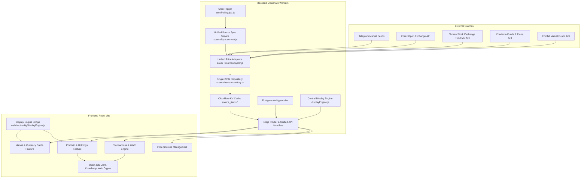

# RealRate System Architecture

RealRate is a financial analysis and portfolio management platform designed to calculate the **intrinsic (real) value** and **speculative bubble** of gold, coins, currencies, and capital market assets in Iran's market.

---

## High-Level Architecture Overview

The system is built as an ultra-fast, serverless monorepo consisting of:
- **Backend (`api/`)**: Built as an Edge-native Cloudflare Worker with zero framework overhead, Postgres through Cloudflare Hyperdrive (the app's data and the price history), and Cloudflare KV (the price book, per-source lists, sessions and settings caches).
- **Frontend (`web/`)**: A modern React SPA built with Vite, utilizing a modular **feature-based architecture**, custom hooks, vanilla CSS design tokens, and Web Crypto API for client-side Zero-Knowledge End-to-End Encryption (E2EE).
- **Display Engine Bridge (`displayEngine.js`)**: Symlinked between `api/src/domain/displayEngine.js` and `web/src/config/displayEngine.js`, guaranteeing 100% identical formatting, naming, unit resolution, and category metadata across both tiers.


```mermaid
graph TD
    subgraph External Sources
        TG[Telegram Market Feeds]
        FX[Forex Open Exchange API]
        TSETMC[Tehran Stock Exchange TSETMC API]
        CFunds[Charisma Funds & Plans API]
        EFunds[Emofid Mutual Funds API]
    end

    subgraph Backend Cloudflare Workers
        Cron[Cron Trigger cronPolling.job.js]
        SyncService[Unified Source Sync Service sourceSync.service.js]
        Adapters[Unified Price Adapters Layer ISourceAdapter.js]
        SourceRepo[Single-Write Repository sourceItems.repository.js]
        KVStorage[Cloudflare KV Cache source_items:*]
        PgStorage[Postgres via Hyperdrive]
        DisplayEng[Central Display Engine displayEngine.js]
        WorkerApp[Edge Router & Unified API Handlers]
    end

    subgraph Frontend React Vite
        DisplayEngWeb[Display Engine Bridge web/src/config/displayEngine.js]
        MarketFeat[Market & Currency Cards Feature]
        PortFeat[Portfolio & Holdings Feature]
        TransFeat[Transactions & WAC Engine]
        AdminFeat[Price Sources Management]
        CryptoE2EE[Client-side Zero-Knowledge Web Crypto]
    end

    Cron --> SyncService
    SyncService --> Adapters
    TG --> Adapters
    FX --> Adapters
    TSETMC --> Adapters
    CFunds --> Adapters
    EFunds --> Adapters
    Adapters --> SourceRepo
    SourceRepo --> KVStorage
    KVStorage --> WorkerApp
    PgStorage --> WorkerApp
    DisplayEng --> WorkerApp
    WorkerApp --> MarketFeat
    WorkerApp --> PortFeat
    WorkerApp --> TransFeat
    WorkerApp --> AdminFeat
    DisplayEngWeb --> MarketFeat
    DisplayEngWeb --> PortFeat
    PortFeat --> CryptoE2EE
    TransFeat --> CryptoE2EE
```

---

## 1. Backend Architecture (`api/`)

The backend follows Clean Architecture principles divided into decoupled layers:

### A. Infrastructure Layer
- **Error Handling (`api/src/infrastructure/errors.js`)**: Standardized custom application errors (`AppError`, `ValidationError`, `NotFoundError`, `AuthError`, `ConflictError`, `DatabaseError`) mapped to HTTP status codes and uniform JSON responses.
- **Structured Logger (`api/src/lib/logger.js` & `api/src/infrastructure/logger.js`)**: Level-based logging (`DEBUG`, `INFO`, `WARN`, `ERROR`) outputting structured JSON logs with correlation IDs, timestamps, and request context.
- **Environment Configuration (`api/src/infrastructure/config.js`)**: Type-safe validation and centralized access for Cloudflare Worker bindings (`DB`, `KV`, secrets, Google OAuth client credentials).

### B. Repository Layer (`api/src/repositories/`)
Decouples database and KV storage queries from business logic. Direct SQL and KV queries are strictly encapsulated in repositories:
- **Database (`lib/database.js`, `lib/pgDatabase.js`, `repositories/pgSchema.js`):** Postgres through Hyperdrive (binding `HYPERDRIVE`, query caching off). The repositories talk to `env.DB` through one small interface (`prepare().bind().first()/all()/run()`, `batch()` as one transaction); each request (and each scheduled run) gets one, on one Hyperdrive connection closed once the request and its background work are done. `pgDatabase.js` turns the repositories' SQL into Postgres's: `?`/`?N` → `$N`, camelCase aliases quoted, `LIKE` → `ILIKE`; BIGINT and NUMERIC come back as numbers. `pgSchema.js` holds the tables, created on first use (`schema.repository.js` `ensureSchema`); `npm run db:schema` prints them as SQL.
- `sourceItems.repository.js`: **What each source last gave, one KV key per source** (`source_items:{sourceId}`): the adapter's cleaned `items`, written by the sync only when they changed. It is the only stored copy of a source's output — no backups, no D1 mirror, no per-source price key. Adapters never write: `parse()` only returns items.
- `sourceSync.service.js`: **The one price pipeline.** Each tick reads the price book (which holds each source's sync state in `sources`), fetches the due sources (one request per endpoint), stores the lists that changed, builds the book from every active source (synced or not) and writes it to KV `prices` — one write — then records the tick's prices in the history. Syncing one source (admin, catalog routes) goes through the same function with `sourceIds`, and still rebuilds the whole book.
- `domain/priceBook.js`: **The price standard.** Every source, automatic or manual, becomes the same item — `{ id, price, name, category, unit, sourceId, updatedAt, params }` — with `price` always in tomans and `id` unique and lower-case. A source declares what it quotes in (`quote`: `toman` by default, `rial`, `usd`, `usd_cross`); dollar quotes are converted once with the book's own USD price (so e.g. the lira is `usdCross × usd`), and gold, coin and silver intrinsic values are computed from the ounce (as items where no source prices them, and as `params.intrinsic`/`bubblePct` where one does). Ids: a single-price source gives its `priceType`, a multi-output feed its item code, a catalog `${sourceId}__${symbol}`; when two sources give the same id, the primary keeps it and the others become `${sourceId}__${id}`. These ids are used everywhere: stored user data, the home page, charts and the history. After every sync the whole book is written as one JSON to KV key `prices` (`GET /api/prices/book`), with each source's sync state (`sources: { [sourceId]: { syncedAt, fetchedAt, count, error } }`, not sent to clients). Items the admin hides from the home page carry `params.hideOnHome`.
- **Price precision:** book prices are whole tomans from 100 up and keep four significant digits below (`roundToman`), so a cheap coin is 0.37, never 0.
- **Admin source switches:** sources are defined in code; an admin can switch one off or make it the primary for its id without a deploy. Those two choices are the only ones kept, in KV `price_source_overrides`, laid over the config wherever sources are read (the sync included). A source can't be created or deleted from the admin.
- `domain/priceGuard.js`: **Implausible prices never reach the book or the history.** Each value a source gives is compared with what it gave last time for the same item; a change beyond the source's `maxJumpPct` (default 25%) is held back — the item keeps its last value — until the same new value repeats for `confirmTicks` syncs in a row (default 3), so a ×10 rial/toman slip or a placeholder is dropped while a real move (a devaluation, a capital increase) is accepted a few minutes late. Waiting values live in `book.sources[id].held`.
- **Stale prices:** a source that hasn't synced for its `staleAfterSec` (default five fetch intervals, at least 30 minutes) marks its items `params.stale` / `params.staleSince`, and prices computed from a stale dollar or ounce (currencies, the ounce in tomans, intrinsic values) are marked too. Home cards show «قدیمی» with the last update time.
- `domain/priceBookViews.js`: **Everything else is a view of the book.** The header's reference rates (`referenceRatesOf`: the sources marked `isReferenceRate`, at their book price), the calculator's live base rates (`baseRatesOf`) and the older `/api/prices` and `/api/market/items` shapes (`legacyPricesOf`) are read off the book, so no screen or route can show a different number than the book. Shared with the web app.
- `domain/priceIds.js`: **Old stored ids → book ids, in one place.** Data saved before the standard carries ids like `src_def_usd`, `derived_gold_18k`, `EUR`, `forex_eur`, `bourse_فولاد`, `src_def_forex::try`, `gold_ounce`, `full_new`; `toPriceId(id, bookIds)` resolves any of them to the book's id, and `migrateRecordPriceIds` rewrites a record's `assetId` / `referenceAssetId` when the result exists in the book. The web app reads with it everywhere and migrates stored data with it: portfolio holdings and transactions are re-encrypted with the new id the next time they are read (`vaultPortfolioItems.js`), and a home page layout is saved again with book ids when it loads.
- **Web prices** (`features/market/priceBookAssets.js`, `PricingContext`): the browser never computes a price. It loads `/api/prices/book` (one request, with the global settings) and uses its prices by id — home cards, the header, the calculator's currencies, portfolio values, transactions, the asset search and trend cards alike. The USD / ounce inputs («نرخ مبنا») are the calculator's what-if rates: they change intrinsic value and bubble in the calculator, never a price.
- `priceHistory.repository.js`: **Price history, kept forever, in Postgres (Cloudflare Hyperdrive, binding `HYPERDRIVE`).** One table, `price_history (item_key, recorded_at, value)`, keyed by the price book's ids, created on the first write; a row is added when an item's value differs from its latest stored value, at the time its source gave the price (never after the sync, never at or before the key's latest row), plus an hourly heartbeat row for live, non-catalog prices — so a flat price and a dead source look different. Each sync records the book's items whose source synced, plus the computed ones. The writer is registered by the Worker entry (`index.js`) through `setPriceHistoryWriter`, because the web app shares market modules with the API and must not import the Postgres driver. `readPriceTrends` serves `GET /api/sparklines` (bucketed series for the home page's trend cards, edge-cached for 5 minutes). Without the binding, or when Postgres is down, nothing is recorded, trends report `available: false`, and the price sync carries on.
- `userRepository.js`: User accounts, roles, settings, Google OAuth mappings.
- `portfolioRepository.js`: Portfolios, multi-portfolio management, sharing slugs, salts, and verifiers.
- `holdingRepository.js`: Encrypted or plaintext holding items, quantities, purchase prices, dates, and notes.
- `transactionRepository.js`: Persistent storage for client-side encrypted buy/sell transactions with Zero-Knowledge payloads.
- `schema.repository.js`: Creates the app's tables (`pgSchema.js`) before a repository first uses them.
- `auditRepository.js`: Security and administrative audit log events.

### C. Unified Adapter Pattern for Ingestion (`api/src/services/market/sources/`)
All upstream price sources implement the standardized `ISourceAdapter` contract (`api/src/services/market/sources/ISourceAdapter.js`):
- **Unified Interface**:
  - `id`: Unique adapter identifier (e.g. `telegram`, `forex_api`, `bourse_symbols`, `emofid_funds`, `charisma_funds`, `charisma_plans`, `api_url`).
  - `name`: Human-readable Persian display name.
  - `supports(sourceConfig)`: Determines whether the adapter handles the specified configuration.
  - `fetchRaw(sourceConfig, env?)`: Fetches raw payload/HTML/JSON from the external endpoint.
  - `parse(raw, sourceConfig, env?)`: **Always** returns `{ items: [{ id, name, price }], datetime }`.
  - `getItems(env?)`: Unified method name across all adapters to retrieve current active items (retiring legacy method names).
- **Universal ID Convention**: ids name the asset, never the provider. A catalog item is `${market}__${symbol}` — the source's `market` (`bourse__فولاد`, `bourse__اهرم`, `charisma_plan__gold`) — so an asset keeps its id if its source is replaced, and a fund listed by the exchange and by its fund house is one id (the first source in config order prices it; another source's copy is `${sourceId}__${market}__${symbol}`). `normalizePriceId` writes every id in one form: lower-case, Arabic ي/ك as ی/ک, Persian/Arabic digits as 0–9, no zero-width characters.
- **Id versions**: stored holdings and transactions carry `priceIdVersion` (`PRICE_ID_VERSION` in `domain/priceIds.js`). Records are stamped when stored; older ones are migrated on read (re-encrypted with the new ids) and then stamped, so the old-form rules and symbol matching only ever apply to old data — an id in today's form is never guessed at.

### D. Single-Tick Polling Orchestrator (`api/src/services/market/sourceSync.service.js`)
- Replaces legacy parallel polling loops with a single unified function: `syncAllSources(env)`.
- Eliminates redundant network calls by automatically deduplicating endpoints shared by multiple sources.
- Executed on every minute tick by Cloudflare Worker Cron (`cronPolling.job.js`).

### E. Domain Specifications, Display Engine & Formulas (`api/src/domain/`)
- `domain/displayEngine.js`: **Central Master Display Engine** responsible for:
  - Resolving item display names: strictly formatted as `"{item.name} ({sourceName})"`.
  - Resolving item units, categories, and badges strictly from `sources.config.js` and `categories.config.js`.
  - Resolving visual colors and Lucide icons data-driven from category definitions.
- `domain/specs/registry.js`: Canonical registry of asset specifications (weight, purity, karat, units, categories).
- `domain/formulas.js`: Pure financial calculation functions:
  - $\text{Gram}_{24k} = \frac{\text{OuncePrice} \times \text{UsdPrice}}{31.1034768}$
  - $\text{IntrinsicValue} = \text{Gram}_{24k} \times \text{Weight} \times \frac{\text{Karat}}{24}$
  - $\text{Bubble} = \frac{\text{MarketPrice} - \text{IntrinsicValue}}{\text{MarketPrice}} \times 100$

---

## 2. Frontend Architecture (`web/`)

The frontend follows a **Feature-Driven Architecture**, keeping related UI, hooks, and API clients colocated.

### Directory Structure
```text
web/src/
├── config/
│   ├── displayEngine.js     # Symlink to api/src/domain/displayEngine.js
│   ├── sources.config.js    # Symlink to api/src/config/sources.config.js
│   └── categories.config.js # Symlink to api/src/config/categories.config.js
├── features/
│   ├── market/              # Market rates, analysis cards, forex list
│   ├── portfolio/           # Portfolio manager, holdings table, date picker, E2EE
│   ├── transactions/        # Buy/Sell Transactions & Automated Holdings Engine (WAC)
│   ├── auth/                # AuthContext, Google OAuth, session management
│   └── admin/               # Admin panel, feeds config, audit logs
├── components/
│   ├── UniversalAssetSearch.jsx # Data-driven universal search across all asset types
│   └── UserSettingsModal.jsx
├── shared/
│   ├── api/                 # httpClient.js (Fetch wrapper, auth tokens, standard error handling)
│   ├── components/          # Header, Navigation, Footer
│   └── ui/                  # AppLayout, Modal, NumericInput, AlertBanner, FilterPills
├── utils/                   # financialSpecs, pricingEngine, calculator
└── pages/                   # Top-level route pages (MainPage, SharedPortfolioPage, PriceSourcesPage)
```

### Key Frontend Features

1. **Central Display Engine Integration**:
   - Zero hardcoded switch statements or brand substring matching in UI components.
   - All presentation logic (names, units, categories, badges, colors, icons) delegates to `displayEngine.js`.
2. **Feature-Colocated State & Hooks**:
   - `usePortfolio`: Handles portfolio switching, creation, deletion, and synchronizing mode-aware badges.
   - `useHoldings`: Handles manual holdings retrieval, auto-migration, E2EE decryption, live bourse price synchronization.
   - `useTransactions`: Handles transaction CRUD with client-side Zero-Knowledge E2EE encryption and decryption.
   - `useComputedHoldings`: Automatically derives current holdings and Weighted Average Cost (WAC) from transaction history.
3. **Account-wide Zero-Knowledge E2EE** (`shared/vault/`, see [E2EE_VAULT.md](E2EE_VAULT.md)):
   - One passphrase (PBKDF2) unwraps a random account key, which wraps a per-portfolio key and encrypts loan, income and cheque records (AES-GCM 256).
   - `loanApi` / `incomeApi` / `chequeApi` route to encrypted in-browser stores when the vault is on; loans run on the shared pure engine `domain/loanDocument.js`, cheques validate with the shared `domain/chequeDocument.js`.
   - The server only stores ciphertext; passphrases never leave the client.
4. **Persian / Shamsi Localization**:
   - Native Jalali calendar calculations (`ShamsiDatePicker.jsx`).
   - "⚡ امروز" (Today) quick button.
   - Eastern Arabic / Persian number parsing and formatting.
5. **Privacy Mode (`btn-privacy-toggle`)**:
   - Masks numbers across all tables and cards with `****`.
   - Global event propagation via `CustomEvent('realrate_privacy_change')`.

---

## 3. سازوکار ویژگی‌های آزمایشی و بتا (Beta Features / Feature Flags)

سیستم دارای سازوکار یکپارچه و چندمرحله‌ای Feature Flag بین کلاینت و سرور است تا امکان تست امکانات جدید در محیط پروداکشن واقعی به صورت امن و محدود به مدیر سیستم فراهم شود:

### چرخه عمر ویژگی‌ها (Feature Stages)
هر ویژگی در فایل مشترک `api/src/config/features.js` (با symlink در `web/src/config/features.js`) تعریف می‌شود:
```javascript
export const FEATURES = {
  cheque_scan: { stage: 'ga', label: 'اسکن چک با هوش مصنوعی', ... },          // همه کاربران
  cheque_scan_debug: { stage: 'beta', label: 'ابزار بررسی دقت اسکن چک', ... }, // فقط مدیر
};
```
- `'off'`: کاملاً غیرفعال برای همه کاربران (همیشه `false`).
- `'beta'`: فعال **فقط برای مدیران سیستم** (`user?.role === 'admin'`). نقش مدیر منحصراً توسط سرور بر اساس `ADMIN_EMAIL` محاسبه می‌شود و کلاینت نقشی در تعیین آن ندارد.
- `'ga'` (General Availability): فعال عمومی برای تمام کاربران وارد شده (`Boolean(user)`).

### امنیت در لایه سرور
- **محافظت مسیرها با `requireFeature` (`api/src/lib/features.js`)**:
  هر مسیر مربوط به ویژگی آزمایشی قبل از هر کاری `await requireFeature(request, env, 'feature_key')` را فراخوانی می‌کند.
  اگر ویژگی برای کاربر فعال نباشد، سرور خطای `404 Not Found` برمی‌گرداند تا وجود اندپوینت مخفی بماند.
- **انتشار در مشخصات کاربر**:
  پاسخ `GET /api/v1/auth/me` آرایه کلیدهای فعال را در فیلد `features: enabledFeatures(user)` ارسال می‌کند.

### استفاده در فرانت‌اند
- **هوک `useFeature(key)`**: با خواندن `user.features` از کانتکست احراز هویت، فعال بودن ویژگی را تعیین می‌کند.
- **کامپوننت `<Feature name="cheque_scan" fallback={null}>`**: جهت رندر مشروط بخش‌های رابط کاربری.
- **نشانگر `<BetaBadge />`**: برچسب ظریف «بتا» با استایل هماهنگ با تم برنامه.
- **قاعده طلایی**: هیچ کامپوننتی نباید مستقیماً `user.role === 'admin'` را برای ویژگی‌های بتا بررسی کند؛ کلیه کامپوننت‌ها ملزم به استفاده از `useFeature` یا `<Feature>` هستند.

### راهنمای افزودن ویژگی جدید بتا
1. ویژگی جدید را با کلید یکتا و مشخصات در `api/src/config/features.js` ثبت کنید (`stage: 'beta'`).
2. اندپوینت‌های سرور را در ابتدای کار با `await requireFeature(request, env, 'key')` محافظت کنید.
3. در کلاینت، دکمه‌ها و المان‌های UI را درون `<Feature name="key">` قرار دهید.
4. پس از اطمینان از پایداری و عملکرد در محیط واقعی، تنها با تغییر `stage: 'ga'` ویژگی را برای عموم کاربران فعال کنید.

## 4. محدودیت استفاده بر اساس دسته کاربر (Usage Limits)

ویژگی‌های پرهزینه (مثل اسکن چک که هر بار به Gemini درخواست می‌دهد) سقف روزانه دارند:

- **`api/src/config/usageLimits.js`**: فهرست ویژگی‌های محدود (`USAGE_LIMITS`) و دسته‌های کاربر (`USER_TIERS`). هر دسته برای هر ویژگی
  یک سقف روزانه دارد؛ دسته `unlimited` (فعلاً مدیر) محدود نمی‌شود. ویژگی‌ای که دسته‌ای برایش سقف ننوشته، برای آن دسته بسته است.
  `userTierOf(user)` دسته هر کاربر را تعیین می‌کند (فعلاً از روی نقش مدیر).
- **`api/src/lib/usageQuota.js`**: `consumeQuota(env, user, key)` یک استفاده را ثبت می‌کند یا با `429 QUOTA_EXCEEDED` رد می‌کند؛
  `refundQuota` استفاده‌ای را که کار پرهزینه‌اش انجام نشد برمی‌گرداند؛ `getQuota` وضعیت امروز را می‌دهد. شمارنده‌ها در KV
  (`quota:<feature>:<userId>:<YYYY-MM-DD>`، دو روز) و روز بر اساس ساعت تهران است. شمارنده KV اتمیک نیست و در دو درخواست همزمان
  ممکن است یک استفاده بیشتر مجاز شود؛ برای سقف روزانه قابل قبول است.
- **افزودن ویژگی محدود جدید**: آن را به `USAGE_LIMITS` اضافه کنید، سقف هر دسته را بنویسید و پیش از کار پرهزینه `consumeQuota` را صدا بزنید.
- **افزودن دسته جدید** (مثلاً پلن پولی): آن را به `USER_TIERS` اضافه و از `userTierOf` برگردانید (مثلاً از ستونی در جدول کاربران).

