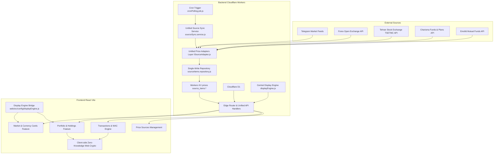

# RealRate System Architecture

RealRate is a market analysis and personal finance platform for Iran: it calculates the **intrinsic (real) value** and the **bubble** of gold and coins, tracks currencies, stocks and funds, and manages portfolios, expenses, accounts, loans, incomes and cheques — with account-wide end-to-end encryption. It runs as a website (with a PWA) and as an Android app built from the same code.

> فارسی: این سند فنی به انگلیسی است؛ برای مرور فارسی معماری [PROJECT_STRUCTURE.md](PROJECT_STRUCTURE.md) و [E2EE_VAULT.md](E2EE_VAULT.md) را ببینید.

---

## High-Level Architecture Overview

The system is built as an ultra-fast, serverless monorepo consisting of:
- **Backend (`api/`)**: Built as an Edge-native Cloudflare Worker with zero framework overhead, Cloudflare D1 (the app's data, the daily price history, counters and other state that must read back exactly) and Workers KV (the price book and per-source lists).
- **Frontend (`web/`)**: A modern React SPA built with Vite, utilizing a modular **feature-based architecture**, custom hooks, vanilla CSS design tokens, and Web Crypto API for client-side Zero-Knowledge End-to-End Encryption (E2EE).
- **Android app (`web/android`)**: The same SPA packaged with Capacitor 8, plus native plugins (bank SMS, fingerprint) and an encrypted offline copy of the user's records.
- **Display Engine Bridge (`displayEngine.js`)**: Symlinked between `api/src/domain/displayEngine.js` and `web/src/config/displayEngine.js`, guaranteeing 100% identical formatting, naming, unit resolution, and category metadata across both tiers.


```mermaid
graph TD
    subgraph External Sources
        TG[Telegram Market Feeds]
        FX[Forex Open Exchange API]
        TSETMC[Tehran Stock Exchange TSETMC API]
        CFunds[Charisma Funds & Plans API]
        EFunds[Emofid Mutual Funds API]
    end

    subgraph Backend Cloudflare Workers
        Cron[Cron Trigger cronPolling.job.js]
        SyncService[Unified Source Sync Service sourceSync.service.js]
        Adapters[Unified Price Adapters Layer ISourceAdapter.js]
        SourceRepo[Single-Write Repository sourceItems.repository.js]
        StateStorage[Workers KV prices source_items:*]
        PgStorage[Cloudflare D1]
        DisplayEng[Central Display Engine displayEngine.js]
        WorkerApp[Edge Router & Unified API Handlers]
    end

    subgraph Frontend React Vite
        DisplayEngWeb[Display Engine Bridge web/src/config/displayEngine.js]
        MarketFeat[Market & Currency Cards Feature]
        PortFeat[Portfolio & Holdings Feature]
        TransFeat[Transactions & WAC Engine]
        AdminFeat[Price Sources Management]
        CryptoE2EE[Client-side Zero-Knowledge Web Crypto]
    end

    Cron --> SyncService
    SyncService --> Adapters
    TG --> Adapters
    FX --> Adapters
    TSETMC --> Adapters
    CFunds --> Adapters
    EFunds --> Adapters
    Adapters --> SourceRepo
    SourceRepo --> StateStorage
    StateStorage --> WorkerApp
    PgStorage --> WorkerApp
    DisplayEng --> WorkerApp
    WorkerApp --> MarketFeat
    WorkerApp --> PortFeat
    WorkerApp --> TransFeat
    WorkerApp --> AdminFeat
    DisplayEngWeb --> MarketFeat
    DisplayEngWeb --> PortFeat
    PortFeat --> CryptoE2EE
    TransFeat --> CryptoE2EE
```

---

## 1. Backend Architecture (`api/`)

The backend follows Clean Architecture principles divided into decoupled layers:

### A. Infrastructure Layer
- **Error Handling (`api/src/lib/AppError.js`, `api/src/middlewares/errorHandler.js`)**: One `AppError` class with an HTTP status and a machine-readable code (`AppError.badRequest`, `.forbidden`, `.notFound`, …); `withErrorHandler` turns any thrown error into the uniform JSON response `{ success: false, message, error: { code, message } }`.
- **Structured Logger (`api/src/lib/logger.js`)**: Single-line JSON logs by level, with passwords, tokens and E2EE keys redacted recursively.
- **Environment (`api/src/config/env.js`)**: Validates the Worker's bindings and variables (`DB`, `KV`, secrets, Google OAuth) and logs what is missing.
- **Request gates (`api/src/index.js`)**, in order: CORS preflight → CSRF origin check for writes → sign-in routes → maintenance mode (`lib/maintenance.js`) → demo gate (`lib/demoGate.js`) → mandatory encryption (`lib/encryptionGate.js`) → the route. Feature-gated routes also call `requireFeature` (`lib/features.js`), and costly ones `consumeQuota` (`lib/usageQuota.js`).

### B. Repository Layer (`api/src/repositories/`)
Decouples database queries from business logic. Direct SQL is strictly encapsulated in repositories (D1 is the source of truth; KV only holds large, read-mostly blobs):
- **Database (`repositories/d1Schema.js`):** Cloudflare D1 (binding `DB`), with Smart Placement so the Worker runs near it. The repositories use D1's own interface (`prepare().bind().first()/all()/run()`, `batch()` as one transaction) and plain SQLite SQL. `d1Schema.js` holds the tables; `ensureSchema` (`schema.repository.js`) checks one `app_schema` version row per isolate and runs the DDL in one batch only when it differs. `npm run db:schema` prints the SQL.
- `stateStore.repository.js`: **State that must read back exactly, in D1 `app_state`** (get / put with expirationTtl / delete / getMany, and an atomic `increment`): rate-limit and quota counters, source overrides, the sources' sync state (`source_states`), the app's latest release. Expired rows are ignored and purged hourly.
- `kvStore.repository.js`: **Large, read-mostly blobs, in Workers KV** (binding `KV`; eventually consistent, up to ~60 s): the price book (`prices`) and each source's items. Without KV it falls back to the D1 state store. `priceBookStore.repository.js` keeps the book in memory for a few seconds and lets concurrent reads share one read; the sync's own (fresh) reads take each source's sync state from D1, so a stale KV copy never makes a source re-fetch early or skip.
- `sourceItems.repository.js`: **What each source last gave, one KV key per source** (`source_items:{sourceId}`): the adapter's cleaned `items`, written by the sync only when they changed. It is the only stored copy of a source's output — no backups, no D1 mirror, no per-source price key. Adapters never write: `parse()` only returns items.
- `sourceSync.service.js`: **The one price pipeline.** Each tick reads the price book (which holds each source's sync state in `sources`), fetches the due sources (one request per endpoint), stores the lists that changed, builds the book from every active source (synced or not) and writes it to `prices` in KV (each source's sync state to D1 first) — then records the tick's prices in the history. Syncing one source (admin, catalog routes) goes through the same function with `sourceIds`, and still rebuilds the whole book.
- `domain/priceBook.js`: **The price standard.** Every source, automatic or manual, becomes the same item — `{ id, price, name, category, unit, sourceId, updatedAt, params }` — with `price` always in tomans and `id` unique and lower-case. A source declares what it quotes in (`quote`: `toman` by default, `rial`, `usd`, `usd_cross`); dollar quotes are converted once with the book's own USD price (so e.g. the lira is `usdCross × usd`), and gold, coin and silver intrinsic values are computed from the ounce (as items where no source prices them, and as `params.intrinsic`/`bubblePct` where one does). Ids: a single-price source gives its `priceType`, a multi-output feed its item code, a catalog `${sourceId}__${symbol}`; when two sources give the same id, the primary keeps it and the others become `${sourceId}__${id}`. These ids are used everywhere: stored user data, the home page, charts and the history. After every sync the whole book is written as one JSON under the state-store key `prices` (`GET /api/prices/book`), with each source's sync state (`sources: { [sourceId]: { syncedAt, fetchedAt, count, error } }`, not sent to clients). Items the admin hides from the home page carry `params.hideOnHome`.
- **Price precision:** book prices are whole tomans from 100 up and keep four significant digits below (`roundToman`), so a cheap coin is 0.37, never 0.
- **Admin source switches:** sources are defined in code; an admin can switch one off or make it the primary for its id without a deploy. Those two choices are the only ones kept, in the state-store key `price_source_overrides`, laid over the config wherever sources are read (the sync included). A source can't be created or deleted from the admin.
- `domain/priceGuard.js`: **Implausible prices never reach the book or the history.** Each value a source gives is compared with what it gave last time for the same item; a change beyond the source's `maxJumpPct` (default 25%) is held back — the item keeps its last value — until the same new value repeats for `confirmTicks` syncs in a row (default 3), so a ×10 rial/toman slip or a placeholder is dropped while a real move (a devaluation, a capital increase) is accepted a few minutes late. Waiting values live in `book.sources[id].held`.
- **Stale prices:** a source that hasn't synced for its `staleAfterSec` (default five fetch intervals, at least 30 minutes) marks its items `params.stale` / `params.staleSince`, and prices computed from a stale dollar or ounce (currencies, the ounce in tomans, intrinsic values) are marked too. Home cards show «قدیمی» with the last update time.
- `domain/priceBookViews.js`: **Everything else is a view of the book.** The header's reference rates (`referenceRatesOf`: the sources marked `isReferenceRate`, at their book price), the calculator's live base rates (`baseRatesOf`) and the older `/api/prices` and `/api/market/items` shapes (`legacyPricesOf`) are read off the book, so no screen or route can show a different number than the book. Shared with the web app.
- `domain/priceIds.js`: **Old stored ids → book ids, in one place.** Data saved before the standard carries ids like `src_def_usd`, `derived_gold_18k`, `EUR`, `forex_eur`, `bourse_فولاد`, `src_def_forex::try`, `gold_ounce`, `full_new`; `toPriceId(id, bookIds)` resolves any of them to the book's id, and `migrateRecordPriceIds` rewrites a record's `assetId` / `referenceAssetId` when the result exists in the book. The web app reads with it everywhere and migrates stored data with it: portfolio holdings and transactions are re-encrypted with the new id the next time they are read (`vaultPortfolioItems.js`), and a home page layout is saved again with book ids when it loads.
- **Web prices** (`features/market/priceBookAssets.js`, `PricingContext`): the browser never computes a price. It loads `/api/prices/book` (one request, with the global settings) and uses its prices by id — home cards, the header, the calculator's currencies, portfolio values, transactions, the asset search and trend cards alike. The USD / ounce inputs («نرخ مبنا») are the calculator's what-if rates: they change intrinsic value and bubble in the calculator, never a price.
- `priceHistory.repository.js`: **Daily price history, kept forever, in D1 (`price_daily (item_key, day, value)`).** One row per item and Tehran day — its last price that day. Each sync upserts the book's items in one statement (the points as one JSON parameter read with `json_each`), rewriting a row only when its value changed. The writer is registered by the Worker entry (`index.js`) through `setPriceHistoryWriter`, because the web app shares market modules with the API. `readPriceTrends` serves `GET /api/sparklines` (one point per day, the last value carried forward; ranges `7d`, `30d` — the default, `90d`, `1y`; the old `1d` is served as `7d`), edge-cached for 5 minutes. Without the binding, or when D1 fails, nothing is recorded, trends report `available: false`, and the price sync carries on.
- `user.repository.js`: User accounts, roles, settings, Google links, and the clients each user signs in from (`user_clients`, `client_activity` — see section 7).
- `session.repository.js`: Sessions (30 days; demo sessions are short-lived).
- `portfolio.repository.js`, `holdings.repository.js`, `transactionRepository.js`: Portfolios (sharing slugs, wrapped portfolio keys) and the legacy plaintext holdings/transactions tables, which are moved into `vault_records` the first time a portfolio is opened.
- `vault.repository.js`: The account vault (`user_vaults`), the encrypted records of every kind (`vault_records`), their tombstones (`vault_tombstones`), the incremental sync and the full reset (section 5).
- `loans.repository.js`, `incomes.repository.js`, `cheques.repository.js`, `customBanks.repository.js`: The plaintext tables of accounts that have not turned encryption on (read and delete only — see [E2EE_VAULT.md](E2EE_VAULT.md)).
- `admin.repository.js`, `demo.repository.js`, `settings.repository.js`, `kvCache.repository.js`: Admin lists and statistics, the demo account, site settings and the price-book cache (state store).
- `schema.repository.js`: Creates the app's tables (`d1Schema.js`) before a repository first uses them.

### C. Unified Adapter Pattern for Ingestion (`api/src/services/market/sources/`)
All upstream price sources implement the standardized `ISourceAdapter` contract (`api/src/services/market/sources/ISourceAdapter.js`):
- **Unified Interface**:
  - `id`: Unique adapter identifier (e.g. `telegram`, `forex_api`, `bourse_symbols`, `emofid_funds`, `charisma_funds`, `charisma_plans`, `api_url`).
  - `name`: Human-readable Persian display name.
  - `supports(sourceConfig)`: Determines whether the adapter handles the specified configuration.
  - `fetchRaw(sourceConfig, env?)`: Fetches raw payload/HTML/JSON from the external endpoint.
  - `parse(raw, sourceConfig, env?)`: **Always** returns `{ items: [{ id, name, price }], datetime }`.
  - `getItems(env?)`: Unified method name across all adapters to retrieve current active items (retiring legacy method names).
- **Universal ID Convention**: ids name the asset, never the provider. A catalog item is `${market}__${symbol}` — the source's `market` (`bourse__فولاد`, `bourse__اهرم`, `charisma_plan__gold`) — so an asset keeps its id if its source is replaced, and a fund listed by the exchange and by its fund house is one id (the first source in config order prices it; another source's copy is `${sourceId}__${market}__${symbol}`). `normalizePriceId` writes every id in one form: lower-case, Arabic ي/ك as ی/ک, Persian/Arabic digits as 0–9, no zero-width characters.
- **Id versions**: stored holdings and transactions carry `priceIdVersion` (`PRICE_ID_VERSION` in `domain/priceIds.js`). Records are stamped when stored; older ones are migrated on read (re-encrypted with the new ids) and then stamped, so the old-form rules and symbol matching only ever apply to old data — an id in today's form is never guessed at.

### D. Single-Tick Polling Orchestrator (`api/src/services/market/sourceSync.service.js`)
- Replaces legacy parallel polling loops with a single unified function: `syncAllSources(env)`.
- Eliminates redundant network calls by automatically deduplicating endpoints shared by multiple sources.
- Executed on every minute tick by Cloudflare Worker Cron (`cronPolling.job.js`).

### E. Domain Specifications, Display Engine & Formulas (`api/src/domain/`)
- `domain/displayEngine.js`: **Central Master Display Engine** responsible for:
  - Resolving item display names: strictly formatted as `"{item.name} ({sourceName})"`.
  - Resolving item units, categories, and badges strictly from `sources.config.js` and `categories.config.js`.
  - Resolving visual colors and Lucide icons data-driven from category definitions.
- `domain/specs/registry.js`: Canonical registry of asset specifications (weight, purity, karat, units, categories).
- `domain/formulas.js`: Pure financial calculation functions:
  - $\text{Gram}_{24k} = \frac{\text{OuncePrice} \times \text{UsdPrice}}{31.1034768}$
  - $\text{IntrinsicValue} = \text{Gram}_{24k} \times \text{Weight} \times \frac{\text{Karat}}{24}$
  - $\text{Bubble} = \frac{\text{MarketPrice} - \text{IntrinsicValue}}{\text{IntrinsicValue}} \times 100$

---

## 2. Frontend Architecture (`web/`)

The frontend follows a **Feature-Driven Architecture**, keeping related UI, hooks, and API clients colocated.

### Directory Structure
```text
web/src/
├── config/                  # Symlinks to api/src/config (+ displayEngine.js from api/src/domain)
├── utils/                   # Symlinks to api/src/domain (price book, loans, cheques, expenses, SMS, …)
├── features/
│   ├── home/                # Customizable market home (web) and the personal dashboard (app)
│   ├── market/              # Price book assets, PricingContext, rate cards and calculator
│   ├── portfolio/           # Portfolios, holdings, custom categories, sharing
│   ├── transactions/        # Buy/sell transactions and the WAC engine
│   ├── expenses/            # Everyday expenses (categories, budgets) and projects
│   ├── accounts/            # Bank accounts, cash, wallets
│   ├── loans/               # Loans, installments, loan usage («تأمین از»)
│   ├── incomes/             # Incomes
│   ├── cheques/             # Cheques, tracking, AI scan
│   ├── sms-inbox/           # Android: bank SMS waiting to be recorded, quick/auto record
│   ├── app-settings/        # Android: SMS, fingerprint and recording settings
│   ├── auth/, demo/, admin/ # Sign-in, demo account, admin panel
├── shared/
│   ├── api/httpClient.js    # Fetch wrapper: token, X-RealRate-Client header, errors
│   ├── vault/               # E2EE state and one encrypted store per record kind
│   ├── offline/             # IndexedDB ciphertext copy, sync engine, outbox (Android)
│   ├── native/              # Capacitor bridges: SMS, fingerprint, haptics, isNativeApp
│   ├── app/                 # Android shell: bottom navigation, quick add, "More"
│   ├── ui/                  # AppLayout, Modal (bottom sheet in the app), charts, tables
│   ├── banks/, features/, hooks/, utils/, pwa/
├── components/              # Header, Footer, mobile drawer, universal asset search, settings
├── seo/pages.js             # Static SEO pages (built by scripts/build-seo.mjs)
├── lib/e2ee.js              # Web Crypto primitives
└── pages/                   # MainPage (every app section), Landing, SharedPortfolio, Admin, Maintenance
```

### Key Frontend Features

1. **Central Display Engine Integration**:
   - Zero hardcoded switch statements or brand substring matching in UI components.
   - All presentation logic (names, units, categories, badges, colors, icons) delegates to `displayEngine.js`.
2. **Feature-Colocated State & Hooks**:
   - `usePortfolio`: Handles portfolio switching, creation, deletion, and synchronizing mode-aware badges.
   - `useHoldings`: Handles holdings retrieval, id migration, E2EE decryption and live prices.
   - `useTransactions`: Handles transaction CRUD with client-side E2EE encryption and decryption.
   - `useComputedHoldings`: Automatically derives current holdings and Weighted Average Cost (WAC) from transaction history.
3. **Account-wide Zero-Knowledge E2EE** (`shared/vault/`, see [E2EE_VAULT.md](E2EE_VAULT.md)):
   - One passphrase (PBKDF2) unwraps a random account key, which wraps a per-portfolio key and encrypts every other record (AES-GCM 256): loans, incomes, cheques, expense sections, expenses and accounts.
   - Each feature's API module (`loanApi`, `incomeApi`, `chequeApi`, …) has a fixed signature and reads/writes through its vault store (`vaultLoans.js`, `vaultExpenses.js`, `vaultAccounts.js`, …); loans run on the shared pure engine `domain/loanDocument.js`, and every kind validates with its shared domain module.
   - The server only stores ciphertext; passphrases never leave the client.
4. **Persian / Shamsi Localization**:
   - Native Jalali calendar calculations (`ShamsiDatePicker.jsx`).
   - "⚡ امروز" (Today) quick button.
   - Eastern Arabic / Persian number parsing and formatting.
5. **Privacy Mode (`btn-privacy-toggle`)**:
   - Masks numbers across all tables and cards with `****`.
   - Global event propagation via `CustomEvent('realrate_privacy_change')`.

---

## 3. Feature Flags (Beta Features)

Features are rolled out through one mechanism shared by the client and the server, so a new feature can be tried in production by the admin alone.

### Stages
Every feature is declared in `api/src/config/features.js` (symlinked as `web/src/config/features.js`):
```javascript
export const FEATURES = {
  cheque_scan: { stage: 'ga', label: 'اسکن چک با هوش مصنوعی', ... },          // every user
  expenses: { stage: 'ga', ... },
  bank_accounts: { stage: 'ga', ... },
  cheque_scan_debug: { stage: 'beta', label: 'ابزار بررسی دقت اسکن چک', ... }, // admin only
};
```
- `'off'`: disabled for everyone.
- `'beta'`: enabled **only for admins** (`user?.role === 'admin'`). The role is computed by the server from `ADMIN_EMAIL`; the client has no say in it.
- `'ga'` (general availability): enabled for every signed-in user.

### Server-side enforcement
- **`requireFeature` (`api/src/lib/features.js`)**: a feature's route calls `await requireFeature(request, env, 'feature_key')` first. When the feature is off for the user the route answers `404 Not Found`, so its existence is not revealed.
- Vault record kinds that belong to a feature (`VAULT_KIND_FEATURES` in `vault.repository.js`: `expense_group`/`expense` → `expenses`, `bank_account` → `bank_accounts`) are gated the same way, in the record routes and in the sync.
- **`GET /api/auth/me`** returns the user's enabled keys as `features: enabledFeatures(user)`.

### Client usage
- **`useFeature(key)`** reads `user.features` from the auth context.
- **`<Feature name="cheque_scan" fallback={null}>`** renders conditionally.
- **`<BetaBadge />`** marks beta UI.
- **Rule:** no component checks `user.role === 'admin'` for a beta feature; always `useFeature` or `<Feature>`.

### Adding a beta feature
1. Declare it in `api/src/config/features.js` with `stage: 'beta'`.
2. Guard its server routes with `await requireFeature(request, env, 'key')`.
3. Wrap its UI in `<Feature name="key">`.
4. Once it is stable in production, switch it to `stage: 'ga'`.

## 4. Usage Limits per User Tier

Costly features (like the cheque scan, which calls Gemini on every use) have a daily limit:

- **`api/src/config/usageLimits.js`**: the limited features (`USAGE_LIMITS`) and the user tiers (`USER_TIERS`). Each tier has a daily limit per feature; the `unlimited` tier (the admin, for now) is never limited. A feature a tier has no limit for is closed to that tier. `userTierOf(user)` picks a user's tier (from the admin role, for now).
- **`api/src/lib/usageQuota.js`**: `consumeQuota(env, user, key)` records one use or refuses with `429 QUOTA_EXCEEDED`; `refundQuota` gives back a use whose costly work did not happen; `getQuota` reports today's state. Counters live in the state store (`quota:<feature>:<userId>:<YYYY-MM-DD>`, kept two days), and the day is Tehran's. A counter is read then written, so two simultaneous requests may allow one extra use — acceptable for a daily limit.
- **A new limited feature**: add it to `USAGE_LIMITS`, set each tier's limit, and call `consumeQuota` before the costly work.
- **A new tier** (e.g. a paid plan): add it to `USER_TIERS` and return it from `userTierOf` (e.g. from a users column).

## 5. Vault Records, Incremental Sync and the Offline Copy

- **One table for all encrypted data**: `vault_records (user_id, kind, id, payload, record_date, parent_id, created_at, updated_at)`. Kinds: `loan`, `income`, `recurring_income`, `cheque`, `holding`, `transaction`, `portfolio_layout`, `expense_group`, `expense`, `bank_account`. Only `record_date` (the record's main date) and `parent_id` (portfolio or expense section) are plaintext, so the server can filter by date range and page lists without seeing amounts.
- **Tombstones**: deleting a record writes `vault_tombstones (user_id, kind, id, deleted_at)`; saving it again removes the tombstone. Tombstones older than 180 days are pruned.
- **`GET /api/vault/sync?cursor=`** returns every change after the cursor (`updated_at|kind|id`), oldest first, a page at a time: saved records (the same ciphertext) and deletions, plus the vault's `epoch` (its creation time). The index `idx_vault_records_updated` keeps this proportional to the new changes, not to the data.
- **Offline client (Android)** — `web/src/shared/offline/`:
  - `localStore.js`: IndexedDB, one database per user: the ciphertext records, an `outbox` of changes made offline, and `meta` (the vault, the cursor, the epoch). The vault key is only ever in memory.
  - `offlineSync.js`: sends the outbox first, then pulls `/api/vault/sync` page by page. Runs on start, on reconnect, when the app comes back to the foreground, after an offline change and every 3 minutes (every 15 s while offline). A queued change the server refuses is dropped, reported, and the copy is rebuilt; a new `epoch` or `reset` rebuilds the copy.
  - `vaultApi.js`: lists are read from the device copy (same filters and order as the server, `filterRecords`) and refreshed in the background (`VAULT_CHANGED_EVENT`). Writes go to the server first and are queued only when there is no connection (network error, 502/503/504).
- **Epoch guard**: every write carries `vaultEpoch`; after a reset (`POST /api/vault/reset`) a write encrypted for the old vault gets `409 VAULT_CHANGED`, so another device cannot write data the new key can't read.

## 6. Android App

- **Shell**: Capacitor 8 (`web/capacitor.config.json`, app id `ir.realrate.app`). The pages ship inside the APK (`vite build --mode app` → `dist-app`) and load from `https://localhost`, which the API's CORS accepts. `shared/native/nativeApp.js` decides what differs in the app (no service worker, share links to the website, Google sign-in in the system browser).
- **App shell** (`shared/app/`, `styles/app-shell.css`, class `is-native-app` on `<html>`): bottom navigation, a quick-add sheet that opens a section's form with `?add=expense|income|holding|loan` (`useQuickAddParam`), a "More" sheet, the personal dashboard at home (`features/home/AppHomeDashboard.jsx`), modals as bottom sheets, and haptics.
- **Native plugins** (`web/android/app/src/main/java/ir/realrate/app/`):
  - `BankSmsPlugin`, `BankSmsReceiver`, `BankSmsRules`: read the inbox and incoming SMS of the bank senders only, keep only withdrawals and deposits (the same templates as `domain/bankSmsTemplates.js`, passed in by `configure`), drop OTP / verification messages natively, and notify without the message text.
  - `BiometricVaultPlugin`: keeps the unlocked vault key encrypted under an Android Keystore key usable only right after a fingerprint check.
- **SMS pipeline** (web side): `shared/native/smsInbox.js` parses with `domain/bankSms.js` and keeps the pending transactions on the device (recorded and dismissed ones remembered separately); `features/sms-inbox/` shows them, fills the expense/income form (`smsDrafts.js`), records in one tap or automatically (`smsRecord.js`, `useSmsAutoRecord.js`), or turns a deposit into a received loan (`LoanDepositSheet.jsx`). A recorded expense/income keeps the transaction's `smsKey`, so nothing is recorded twice, even from another device.
- **Builds and releases** (`.github/workflows/android.yml`): on `main`, a release APK signed with the key in the repository secrets, published as GitHub release `v1.0.<run>` with notes extracted from `CHANGELOG.md` and the stable asset `realrate.apk`. `VITE_APP_VERSION` carries the version name into the app. The website's static page `/android` (`web/src/seo/pages.js`, `scripts/build-seo.mjs`) links the latest release.
- Details: [ANDROID.md](ANDROID.md).

## 7. Client Identification (App Users in the Admin Panel)

- Every authenticated request carries `X-RealRate-Client`: `android/<version>` from the app, `web` from the site (`domain/clientInfo.js`: `formatClientHeader`, `parseClientHeader`, `compareVersions`; sent by `shared/api/httpClient.js`, allowed by CORS).
- `GET /api/auth/me` — called each time the app opens — records it: `user_clients (user_id, platform)` keeps the first/last time and the latest version of each client, and `client_activity (user_id, platform, day)` the days each client was used. Demo sessions are not recorded.
- The admin panel reads them (`admin.repository.js`): the "app users" stats (active today / in 30 days), the users on each app version, an "app" filter and badge in the users list, the "active in the app" growth series, and the devices of each user.
